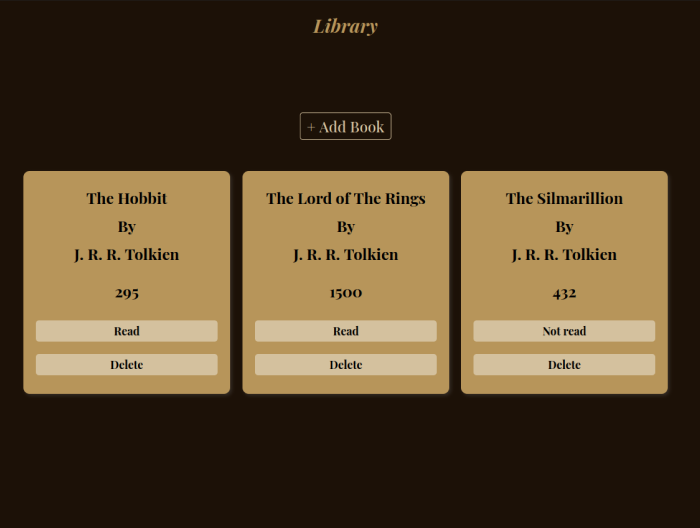

# Library

## Table of contents

- [Overview](#overview)
  - [Screenshot](#screenshot)
  - [Links](#links)
- [Style Guide](#style-guide)
  - [Colors](#colors)
- [My process](#my-process)
  - [Built with](#built-with)
- [Author](#author)

## Overview 

  A small library app that can add books with its title, author, pages. Furthermore, it has a status showing if the book has been read and a delete button.

### Screenshot

### Links

- Live Site URL: [Library](https://gabrielojorge.github.io/library/).

## Style Guide

### Colors

- clr-dark-brown: #1c1107;
- clr-light-brown: #73441e;
- clr-shadow: #332b24;
- clr-gold: #b7955a;
- clr-outline: #442b16;
- clr-btn: #d4c19e;

### Typography

### Body

- Family: [Playfair Display](https://fonts.google.com/specimen/Playfair+Display);
- Weights: 400, 500, 700.

## My Process

### Built with

- HTML5;
- CSS;
- JavaScript;
- Flexbox;
- Grid;
- Mobile-first workflow.

## Author

- Website - [Gabriel O. Jorge](https://gabrielojorge.github.io/Portifolio/).